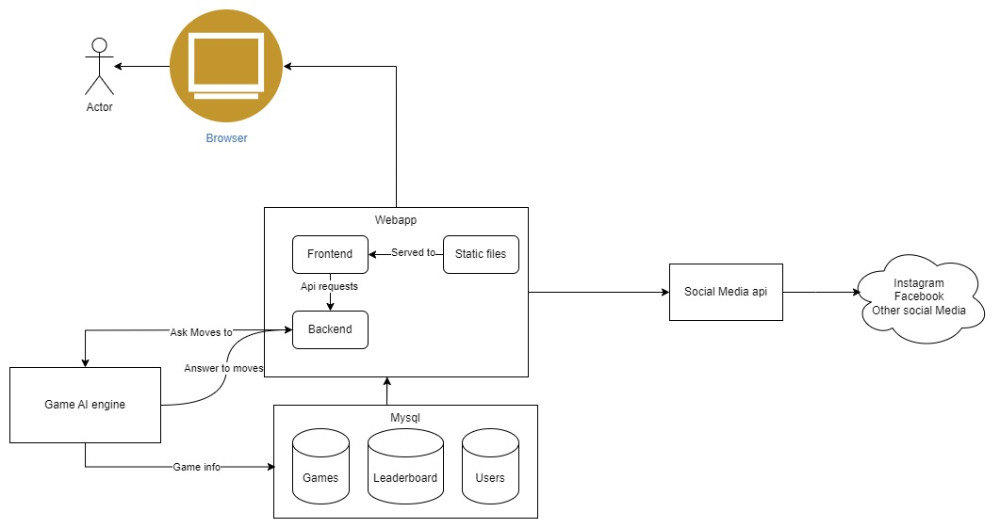
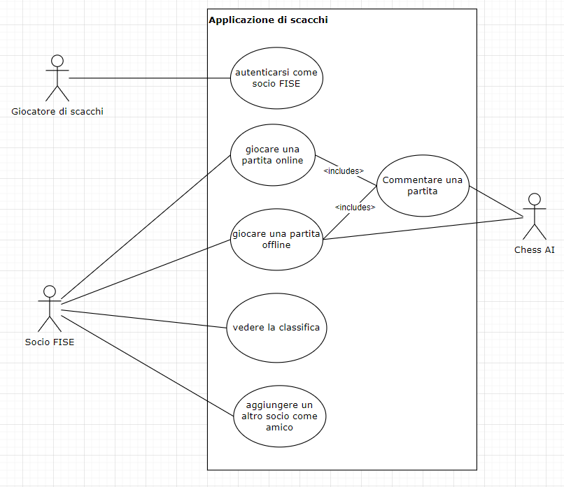
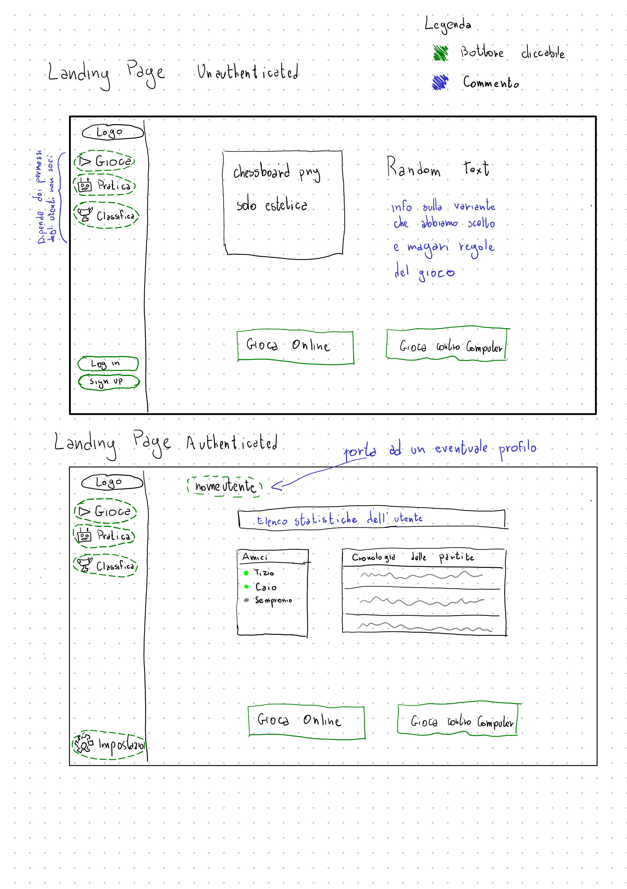
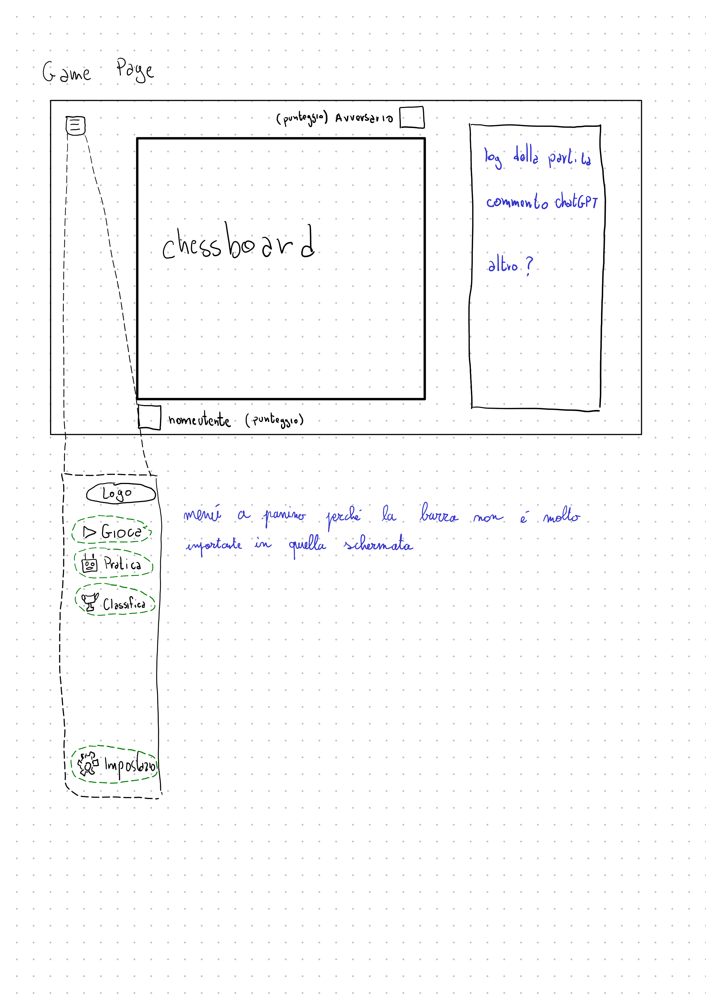

Authors:
    - Xuanqiang "Angelo" Huang
    - Emanuele Pischetola

# Deliverables sprint - 0

Questo documento contiene alcuni commenti sui deliverables del primo sprint.

- Architettura ad alto livello del nostro sistema
- Un diagramma use-case
- Un mockup dell'interfaccia grafica (wireframes)
- Relazione scrumble
- Autovalutazione scrumble
- Relazione Escape the boom

Inoltre abbiamo prodotto qualche documento in più durante questa prima fase:
- [Analisi delle varianti di scacchi](analisi-chess-variants.md)
- [Analisi delle api-social](analisi-social.md)
- [Descrizione del sistema di deployment](deployment.md)

## Architettura ad alto livello

Abbiamo immaginato un'architettura a microservizi, in cui ogni servizio è indipendente dagli altri e comunica tramite API REST. In questo modo, è possibile scalare ogni servizio in modo indipendente, e anche sostituirlo con un'implementazione diversa, purché rispetti l'interfaccia.

Gli esempi di microservizi:
- Chess Engine (the bot player)
- Database
- Backend Webapp

Solamente la webapp è accessibile dall'utente, mentre gli altri servizi sono accessibili solamente internamente.
L'api per i social sarà gestito dal backend webapp.

## Diagramma use-case

Abbiamo immaginato 3 attori:
- Utente non registrato
- Utente registrato (socio FISE)
- Chess Engine

Il primo potrà solamente autenticarsi e registrarsi, mentre il secondo potrà giocare e vedere la classifica degli utenti.
L'ultimo attore è il bot che può giocare o commentare le partite.

## Mockup dell'interfaccia grafica

Il mockup si può dividere tra *landing page* e *game page*.

- landing page: è la prima pagina che vede l'utente e sono presenti 2 versioni, in base all'autenticazione
- game page: è la pagine in cui l'utente può interagire con la scacchiera e sia in modalità online che contro il bot

## Scrumble - Relazione

Vedere la relazione a parte, [qui](teambuilding/scrumble.md)

## Scrumble - Autovalutazione

Dobbiamo ancora completarlo, per ora è un [draft](https://docs.google.com/spreadsheets/d/1mYGywgVW77pcez10G1Iro446DC-8MtnTtd6z4gEtbSA/edit#gid=2098895911)

## Escape the boom - Relazione

Vedere la relazione a parte, [qui](teambuilding/escape-the-boom.md)