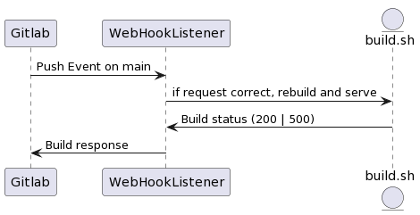

# Deployment

## Sync branch di gitlab

### Perché è utile

**Automatizziamo** la parte di produzione, così abbiamo una chiara separazione fra lo sviluppo locale
e il sito in *production*, che sarà quello che l'utente finale vedrà.
È importante quindi mandare in production solamente quello che abbiamo testato e che sembra funzionare bene.

### Descrizione ad alto livello

- Ogni push su una branch preconfigurata di gitlab crea un **webhook**
- Questo webhook fa una richiesta a un nostro servizio, il **webhook_listener**
- Se riceve una richiesta corretta (con giusto segreto impostato) allora chiama uno script per ribuildare il servizio e restartarlo in modo aggiornato

### Sequence diagram

<!--
@startuml gitlabSync
participant Gitlab
participant WebHookListener
entity build.sh as Build

Gitlab -> WebHookListener: Push Event on main
WebHookListener -> Build: if request correct, rebuild and serve
Build -> WebHookListener: Build status (200 | 500)
WebHookListener -> Gitlab: Build response
@enduml
-->